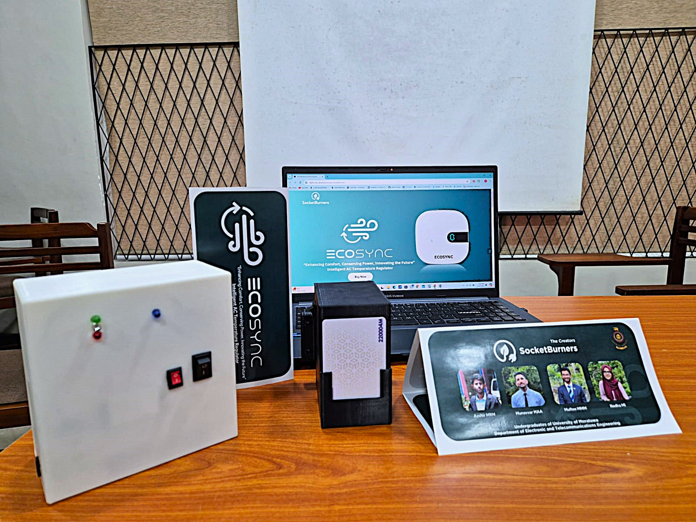

  

<h1 align="center">Hi, I'm Ahmed Munavvar 👋</h1>
<h3 align="center">Electronics & Telecommunication Engineering Undergraduate | University of Moratuwa</h3>

---

## 🌟 About Me

- 🎓 3rd-year Electronics & Telecommunication Engineering student at UoM  
- 🔧 Focused on analog & mixed-signal design, PCB development, and embedded systems  
- 🚀 Interested in machine learning applications in hardware and open-source IC design tools  
---

## 🛠️ Skills

  
  
  
  
  

---

## 🚀 Featured Project

### [ECOSYNC – Automated AC Temperature Regulator](https://github.com/ahmedm0913/ECOSYNC)

  

- 🛠️ Team Leader – PCB design (KPD & ACC), project coordination, and business pitching  
- 🌱 Built a smart AC temperature regulator for hotel rooms using IR + BLE  
- 🏆 **Awards:** IESL TechnoSpark Runner's Up, INSEE Circular Economy Challenge Runner's Up, IEEE Future Innovators Challenge 2nd Runners and Most Popular Innovation and IESE Grant Scheme Finalists  

---

## 📂 Other Projects (Coming Soon)

- 🟢 **Industrial Strain Gauge Torque Sensor**  
- 🎸 **Analog Guitar Tuner**  
- 🎧 **High-Fidelity Analog Headphone Amplifier**

---

## 📊 GitHub Stats

  
  

---

## 📬 Connect with Me

  
  
  

---

  <em>“Built for energy efficiency. Engineered with passion.”</em>

